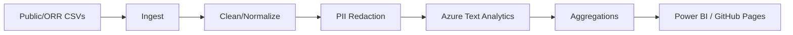

# TDLR Sentiment (Compliant, GitHub‑first)

Measure sentiment and themes around the **Texas Department of Licensing & Regulation (TDLR)** using *compliant* public datasets (e.g., published complaint or disciplinary records) and your own surveys or records requests. **Do not** scrape or bulk process Google Maps/Places reviews or other sources that forbid ML/analysis under their Terms.

> ⚖️ **Compliance note:** This project **does not ingest Google reviews** or any other source that disallows scraping, bulk export, or ML analysis. Keep raw exports private and never commit PII.

## Goals
- Ingest **publicly available TDLR data** (complaints, enforcement/discipline, etc.) and/or **your own ORR CSV exports**.
- Clean & normalize text, **redact PII**, then perform **document-level sentiment** (Azure Cognitive Services).
- Publish **aggregated** outputs and simple charts (GitHub Pages) and/or feed them to **Power BI**.

## Architecture


## Quickstart

### 1) Setup
- Install Python 3.11+
- Set secrets in your environment:
  ```bash
  export AZURE_TEXT_ENDPOINT="https://<your-resource>.cognitiveservices.azure.com/"
  export AZURE_TEXT_KEY="<your-key>"
  ```

### 2) Create & activate env
```bash
python -m venv .venv
source .venv/bin/activate  # Windows: .venv\Scripts\activate
pip install -e .
```

### 3) Run pipeline locally
```bash
python src/ingest/fetch_public_data.py      # reads CSVs you drop into data/raw_inbox
python src/transform/clean_normalize.py
python src/nlp/azure_sentiment.py
python src/analytics/aggregates.py
python src/viz/build_site.py                # writes docs/index.html
```

### 4) Publish simple site
- Go to **Settings → Pages → Build from `/docs`**.

## Data management
- Put raw files in `data/raw_inbox/` locally (ignored by git). The pipeline packages them to `data/raw/*.parquet`.
- **Never commit PII**. Only commit redacted/aggregated outputs (e.g., monthly sentiment by program).
- Optionally push processed CSVs to Azure Blob; restrict the repo to non-sensitive charts and readmes.

## Repo layout
```
tdlr-sentiment/
├─ README.md
├─ LICENSE
├─ CODE_OF_CONDUCT.md
├─ SECURITY.md
├─ .gitignore
├─ .gitattributes
├─ pyproject.toml           # project metadata & deps
├─ devcontainer.json        # optional: Codespaces
├─ data/
│  ├─ raw_inbox/.gitkeep
│  ├─ raw/.gitkeep
│  ├─ interim/.gitkeep
│  └─ processed/.gitkeep
├─ docs/
│  ├─ index.md
│  └─ methodology.md
├─ notebooks/
│  ├─ 01_explore.ipynb
│  └─ 02_model_eval.ipynb
├─ src/
│  ├─ ingest/fetch_public_data.py
│  ├─ transform/clean_normalize.py
│  ├─ nlp/azure_sentiment.py
│  ├─ analytics/aggregates.py
│  └─ viz/build_site.py
└─ .github/workflows/
   ├─ ci.yml
   └─ nightly_pipeline.yml
```

## Acknowledgments & licensing
- Code licensed under **MIT** (see `LICENSE`).
- Data remains owned by the original sources and may be subject to their terms.
- You are responsible for verifying ToS and privacy obligations for any dataset you use.

_Last updated: 2025-10-13_
